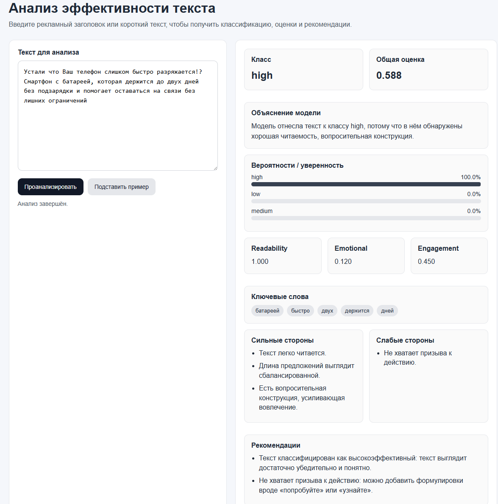

# Content Effectiveness Analyzer

Веб-приложение и API для анализа эффективности рекламных текстов с использованием методов машинного обучения и эвристических правил.

Проект позволяет оценить текст по нескольким критериям, классифицировать его и получить рекомендации по улучшению. Система ориентирована на анализ коротких рекламных заголовков и маркетинговых формулировок.

---

##  Основные возможности

- Классификация текста:
  - `low` — низкая эффективность
  - `medium` — средняя эффективность
  - `high` — высокая эффективность

- Анализ текста по метрикам:
  - читаемость (readability)
  - эмоциональность (emotional)
  - вовлечённость (engagement)
  - итоговая оценка

- Выделение:
  - сильных сторон текста
  - слабых сторон текста

- Генерация рекомендаций по улучшению

- Объяснение решения модели

- Веб-интерфейс для взаимодействия с системой

---

##  Используемые технологии

- Python
- FastAPI
- scikit-learn
- LinearSVC / LogisticRegression / RandomForest
- TF-IDF + числовые признаки
- HTML / CSS / JavaScript
- Jinja2

---

##  Архитектура проекта

Проект построен по модульному принципу и разделён на несколько уровней:

- `analyzer.py` — извлечение признаков и rule-based логика
- `model.py` — работа с ML-моделью
- `service.py` — объединение логики и формирование ответа
- `schemas.py` — описание структуры данных
- `main.py` — запуск API и маршруты

Также присутствуют:
- `scripts/` — обучение модели
- `models/` — сохранённые модели
- `templates/` и `static/` — пользовательский интерфейс

---

## 🚀 Установка и запуск (для пользователя)

1. Клонировать репозиторий:
```
git clone https://github.com/USERNAME/content-effectiveness-api.git
cd content-effectiveness-api
```

2. Создать виртуальное окружение:
```
python -m venv .venv
```

3. Активировать окружение:

Windows:
```
.venv\Scripts\activate
```

Linux / macOS:
```
source .venv/bin/activate
```

4. Установить зависимости:
```
pip install -r requirements.txt
```

5. Запустить сервер:
```
python -m uvicorn app.main:app --reload
```

---

##  Доступ к интерфейсам

После запуска доступны:

- Swagger API:
```
http://127.0.0.1:8000/docs
```

- Web UI:
```
http://127.0.0.1:8000/ui
```

---

##  Пример использования

Пример запроса:

```json
{
  "text": "Смартфон с батареей, которая держится до двух дней без подзарядки"
}
```

Пример ответа:

```json
{
  "predicted_class": "high",
  "probabilities": {
    "high": 0.91,
    "medium": 0.07,
    "low": 0.02
  },
  "readability_score": 0.9,
  "emotional_score": 0.3,
  "engagement_score": 0.6,
  "overall_score": 0.7,
  "strengths": ["..."],
  "weaknesses": ["..."],
  "recommendations": ["..."],
  "top_keywords": ["смартфон", "батарея"],
  "model_explanation": "..."
}
```

---

##  Принцип работы

1. Из текста извлекаются признаки:
   - длина текста
   - длина предложений
   - наличие CTA
   - эмоциональные слова
   - уникальность слов
   - пунктуация

2. ML-модель:
   - использует TF-IDF + числовые признаки
   - классифицирует текст

3. Rule-based система:
   - рассчитывает дополнительные метрики
   - формирует рекомендации

4. Интерпретация:
   - strengths / weaknesses
   - объяснение результата

---

##  Обучение модели (для разработчика)

1. Подготовка данных:
```
python scripts/preprocess_data.py
```

2. Обучение:
```
python scripts/train_model.py
```

Результат:
- модель сохраняется в `models/`
- метрики записываются в файл

---

##  Особенности реализации

- Гибридный подход: ML + эвристики
- Интерпретируемость результатов
- Устранён bias на простые признаки (например, "!")
- Акцент на содержательных характеристиках текста

---

##  Руководство разработчика

Добавление нового признака:
1. Добавить в `analyzer.py`
2. Добавить в `schemas.py`
3. Добавить в `train_model.py`

Добавление endpoint:
1. Реализовать в `service.py`
2. Описать схему в `schemas.py`
3. Добавить маршрут в `main.py`

Изменение UI:
- HTML: `templates/index.html`
- стили: `static/style.css`
- логика: `static/app.js`

---

##  Отладка

Ошибка 500:
- проверить соответствие `response_model`
- убедиться, что все поля возвращаются

Модель не загружается:
- проверить путь к `.joblib`

Swagger показывает старые данные:
- перезапустить сервер
- проверить порт

---

## Реализация проекта в соответствии с методологией CRISP-DM
## 1. Постановка задачи (Business Understanding)

Целью работы является разработка программного решения для автоматической оценки эффективности рекламных текстов. В рамках задачи требуется создать API, обеспечивающее взаимодействие пользователя с моделью машинного обучения, а также реализовать механизм анализа текстового контента и выдачи рекомендаций.

Основные задачи:

классификация текстов по уровню эффективности (low, medium, high);
анализ структуры и содержания текста;
выявление сильных и слабых сторон;
формирование рекомендаций по улучшению;
предоставление результатов через API и пользовательский интерфейс.

Практическая значимость заключается в возможности использования системы для первичной оценки маркетинговых текстов и повышения их качества.


## 2. Анализ данных (Data Understanding)

Для решения задачи был сформирован датасет рекламных текстов, включающий короткие заголовки и описания. Данные были размечены вручную по трём классам эффективности:

низкая (low),
средняя (medium),
высокая (high).

Анализ показал, что:

тексты имеют небольшую длину (в среднем 5–20 слов);
часто используются маркетинговые конструкции (призыв к действию, указание выгоды);
простые признаки (например, наличие восклицательного знака) могут искажать результат классификации.

Вследствие этого было принято решение использовать комбинацию текстовых и структурных признаков.


## 3. Подготовка данных (Data Preparation)

На этапе подготовки данных выполнялась предварительная обработка текста:

нормализация регистра;
удаление лишних символов;
разбиение на слова и предложения.

Из текста извлекались следующие признаки:

количество символов, слов и предложений;
средняя длина слова и предложения;
количество восклицательных и вопросительных знаков;
количество эмоционально окрашенных слов;
наличие призывов к действию (CTA);
доля уникальных слов.

Дополнительно использовалось векторное представление текста с помощью TF-IDF.

Подготовленные признаки объединялись в единое представление, используемое при обучении модели.


## 4. Моделирование (Modeling)

Для решения задачи классификации были рассмотрены несколько моделей машинного обучения:

LinearSVC;
Logistic Regression;
Random Forest.

Модели обучались на комбинации:

TF-IDF признаков;
числовых признаков текста.

В качестве финальной модели была выбрана LinearSVC, показавшая наилучшее качество классификации.

Особенностью реализации является использование гибридного подхода:

модель машинного обучения отвечает за классификацию;
rule-based логика используется для интерпретации результатов и генерации рекомендаций.


## 5. Оценка результатов (Evaluation)

Оценка качества модели проводилась с использованием метрики accuracy, а также анализа предсказаний.

В ходе анализа выявлено:

избыточное влияние простых признаков (например, восклицательных знаков);
необходимость усиления роли содержательных характеристик текста.

В результате:

датасет был дополнен более разнообразными примерами;
признаки были переработаны;
снижена зависимость модели от поверхностных факторов.

Это позволило повысить устойчивость модели и улучшить качество классификации.


## 6. Внедрение (Deployment)

В рамках этапа внедрения была реализована система, включающая:

API на основе FastAPI:
/predict — классификация текста;
/analyze — базовый анализ;
/analyze-advanced — расширенный анализ;
пользовательский интерфейс:
веб-страница с формой ввода текста;
отображение результатов анализа.

Система возвращает:

класс эффективности;
оценки по метрикам;
ключевые признаки текста;
сильные и слабые стороны;
рекомендации;
текстовое объяснение результата модели.

Это позволяет использовать решение как самостоятельный инструмент анализа или как часть более сложной системы.
---
## Пример работы


